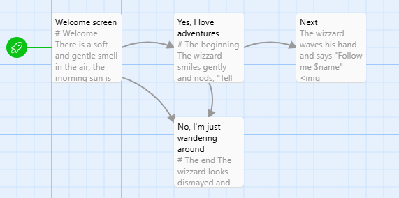

# Twine Jukselapp

For å lage historier med Twine bruker vi nettsiden (https://twinery.org/) og klikker på "Use in your browser"

!!! Warning
    Merk at fortellingene du lager lagres lokalt på din datamaskin, det betyr at hvis du nullstiller nettleserdata mister du fortellingen din.

## Passage

En fortelling i Twine er bygget opp av såkalte Passage elementer, disse fungerer som sider i en bok. Forskjellen her ligger i at de ulike sidene (Passage) kan kobles sammen, slik at leseren selv velger sin vei igjennom boka.




## Navigasjon

For å lage koblinger mellom de ulike Passagene lager du linker ved å skrive tittelen på den mellom tegnene `[[ ]]`, hvis Passagen ikke eksisterer oppretter Twine den for deg.


### Eksempel
Eksempelet nedenfor er en Passage som gir brukeren to valg "Ja" og "Nei". Koden `[[Nei->Avslutt]]` viser brukeren teksten Nei men linker til Passagen med navn Avslutt
```
# Velkommen

Er du klar til å gå på et eventyr?

[[Ja]]
[[Nei->Avslutt]]
```

## Kommandoer
Når du skal sende kommandoer til Twine setter du dette i parantes `( )`.s

## Variabler

Variabler i Twine starter med et `$` tegn, så foreksempel vil `$navn` lage en variabel kalt `navn`.

### Sette Variabler

For å lagre noe i en variabel bruker du kommandoen `set:` slik som i eksempelet nedenfor.

```
(set: $variabelNavn = verdi)
```

### Variabeltyper
Det finnes mange variabeltyper i Twine, de vanligste er:
- **Strenger**: `"tekst"` eller `'tekst'`
- **Tall**: `123`, `3,14`
- **Boolske verdier**: `true`, `false`

### Variabeloperasjoner

Nedenfor er eksempler på hvordan du kan jobbe med variabler

```
(set: $num to it + 1)        // Legg til variabel
(set: $tekst to it + " mer") // Slå sammen strenger
```

## Tekstformatering

Du kan formatere teksten din ved hjelp av enkelte tegn, listen nedenfor viser noen eksempler.

```
# Stor overskrift
##  Liten overskrift
*Kursiv tekst*
**Fet tekst**
```

## Bilder

Du kan legge inn bilder og andre elementer ved å skrive html koden rett i Passagedn din.

!!! info

    Bildet må ligge tilgjengelig på nett for at Twine skal finne det.

### Eksempel

Koden nedenfor legger inn et bilde fra unsplash.com

```html

```

!!! tip
    Ved å legge til `width="100%"` i img taggen din tilpasses bildet til bredden på siden.

## Video

Du kan legge inn videoer fra youtube (eller tilsvarende sider) ved å kopiere embed koden fra youtube.

## Header, Footer og Startup

Du kan legge inn informasjon som viser på alle sidene, dette gjør du ved å legge til en tag, de vanligste er:

- header : Passager med denne taggen viser på toppen av alle sider
- footer : Passager med denne taggen viser dederst på alle sider
- startup : Passager med denne taggen kjøres når du starter historien din, de kjøres altså bare en gang.

!!! Tip
    Disse taggene **må** skrives med små bokstaver for at de skal virke.

## Logikk

### If-Setninger
```
(if: betingelse)[
  Innhold som vises hvis betingelsen er sann
]

(if: betingelse)[
  Sann-innhold
](else:)[
  Usann-innhold
]

(if: betingelse1)[
  Innhold for betingelse1
](else-if: betingelse2)[
  Innhold for betingelse2
](else:)[
  Standard-innhold
]
```

### Interaktive Betingelser

Eksempelet nedenfor vises kun hvis variabelen $var er 1.

```
(link: "Klikk meg")[(if: $var is 1)[Resultat 1](else:)[Resultat 2]]
```

### Løkker
Eksempelet nedefor skriver ut tallene 1-10

```

(for: _i range (1,10))[
  (print: _i)                
]

(for: each _num, ...(range:1,10))[
  (print: _num)
]
```
